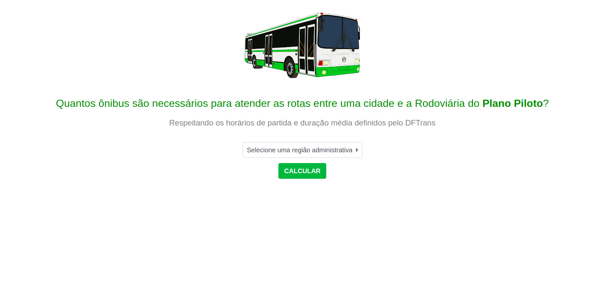
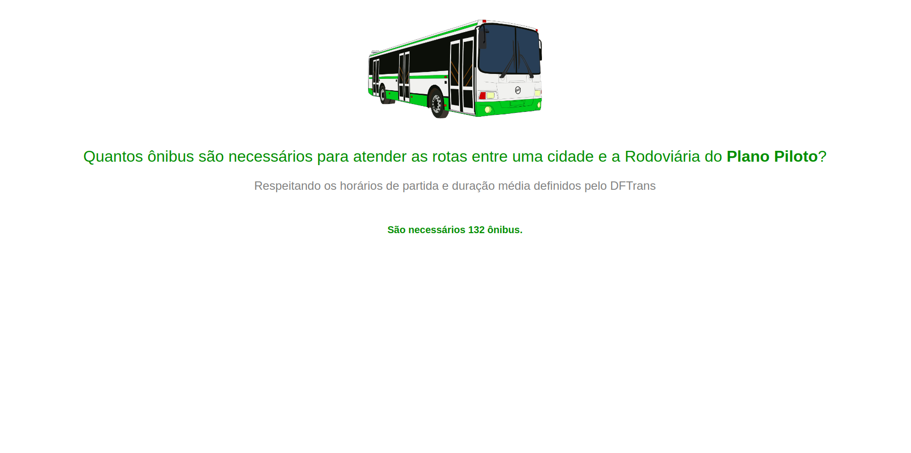
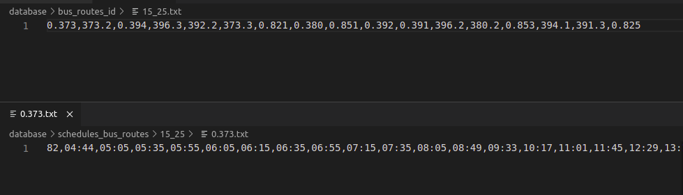
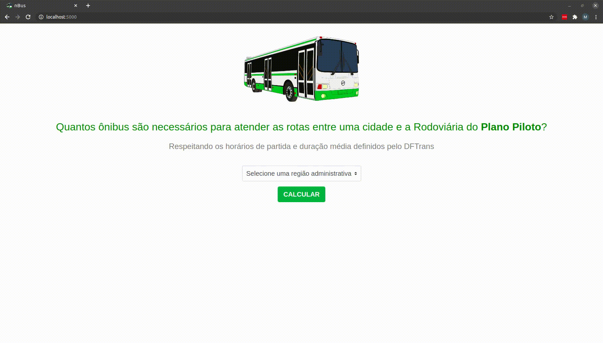

# nBus

**Número da Lista**: 3<br>
**Conteúdo da Disciplina**: Greed<br>

## Alunos
| Matrícula | Aluno |
| -- | -- |
| 17/0013812 | [Matheus Rodrigues](https://github.com/rjoao) |

## Sobre 
O objetivo do projeto é calcular a quantidade de ônibus necessários para atender as rotas entre uma cidade e a Rodoviária do Plano Piloto utilizando o algoritmo de Interval Partitioning. Pois respeitará os horários de partida e duração média definidos pelo DFTrans.

As linhas de ônibus, os seus horários de partida e a sua duração média de percuso foram coletados no site do DFTrans e compõem o banco de dados utilizado pelo projeto. O algoritmo é aplicado sobre esses dados.

É possível separar o projeto em:
- Criação e Alimentação do Banco de Dados
  - Coleta dos dados
  - Escrita dos dados nos arquivos
- Execução do Projeto
  - Escolha da Cidade
  - Visualização do Resultado

## Screenshots

### Página Inicial


### Página Resultado


### Banco de Dados


## Vídeo


**[Video MP4](./static/video.mp4)**

## Instalação 
**Linguagem**: Python3<br>

É necessário possuir o sistema de gerenciamento de pacotes **pip3**.

Se não possuir, no Ubuntu, rode o seguinte comando no terminal:

```
sudo apt-get install python3-pip
```

## Uso 

No terminal, primeiro instale os requisitos do projeto e depois execute o arquivo principal.

### Instalação dos requisitos

```
make install
```

### Execução do projeto

```
make run
```

## Outros 
Um [script](./script/create_populate_database.py) foi utilizado para a coleta dos dados. 


